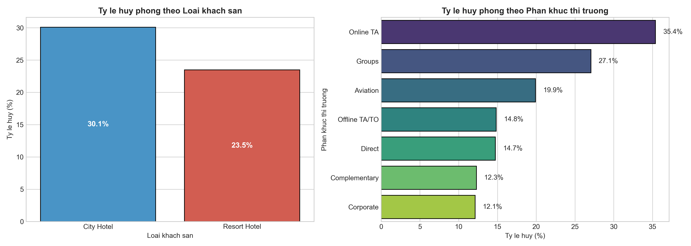
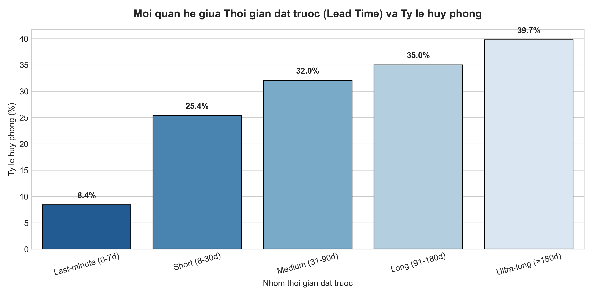
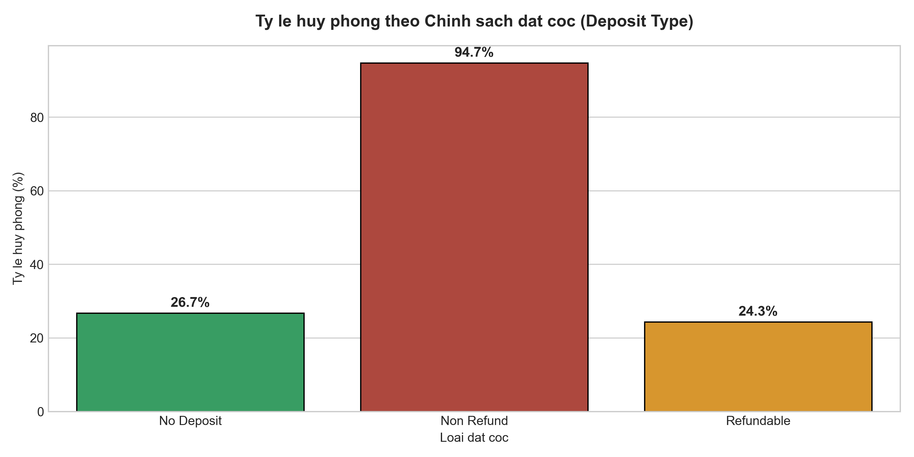
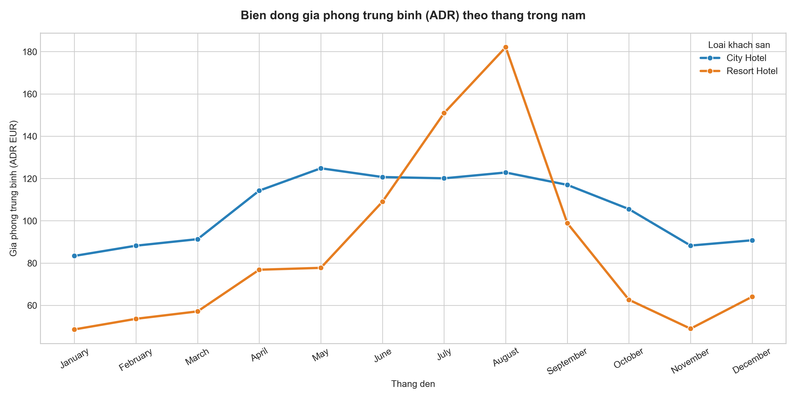
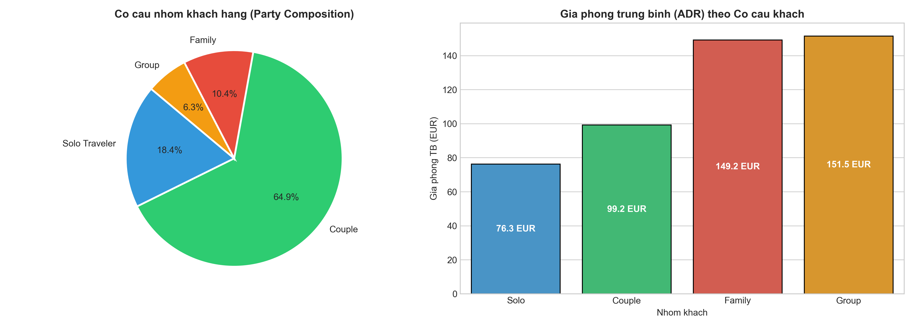
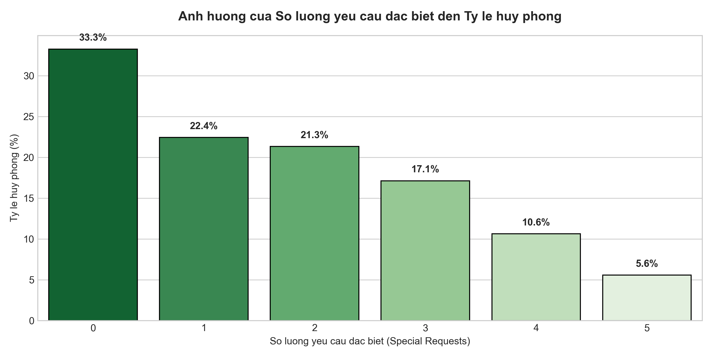
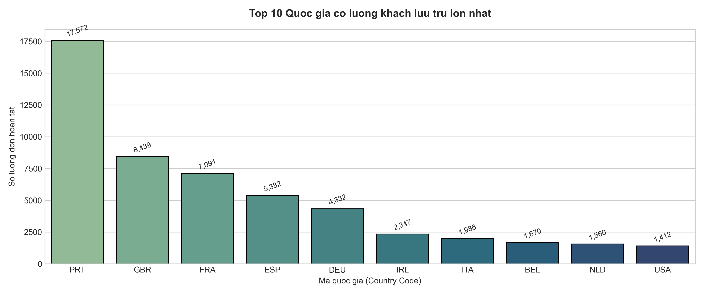
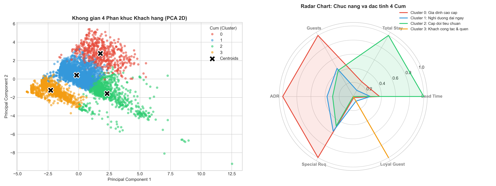

# BÁO CÁO PHÂN TÍCH CHUYÊN SÂU & INSIGHTS KINH DOANH (HOTEL BOOKING BUSINESS INSIGHTS REPORT)

Báo cáo này tổng hợp các phát hiện dữ liệu, phân tích trực quan và đề xuất chiến lược kinh doanh thực tế từ tập dữ liệu đặt phòng khách sạn (**Hotel Booking Demand Dataset**).

Tất cả các biểu đồ phân tích trong báo cáo được tự động khởi tạo bởi module [`src/eda.py`](../src/eda.py) và lưu trữ tại thư mục [`reports/figures/`](figures/).

---

## TÓM TẮT ĐIỀU HÀNH (EXECUTIVE SUMMARY)

1. **Rủi ro Hủy phòng**: Tỷ lệ hủy phòng trung bình là **27.5%** trên toàn bộ dữ liệu sạch. City Hotel có tỷ lệ hủy cao hơn Resort Hotel. Thời gian đặt trước (`lead_time`) càng dài thì xác suất hủy càng tăng vọt (đạt >45% với đơn đặt trước trên 6 tháng).
2. **Biến động Mùa vụ & Doanh thu (ADR)**: Resort Hotel có tính mùa vụ cực kỳ rõ rệt, bùng nổ doanh thu vào tháng 7 và tháng 8 (ADR vượt 150 EUR/đêm), nhưng sụt giảm mạnh vào mùa đông. City Hotel duy trì mức giá ổn định quanh năm.
3. **Chân dung & Giá trị Khách hàng**: Nhóm khách đi theo **Gia đình (Family)** mang lại giá phòng trung bình (ADR) cao nhất (~150 EUR). Ngược lại, nhóm khách có **yêu cầu đặc biệt (Special Requests)** có tỷ lệ cam kết lưu trú cao vượt trội so với khách không có yêu cầu nào.
4. **Phân khúc Khách hàng Machine Learning (K-Means $k=4$)**: Dữ liệu phân tách thành 4 nhóm chân dung rõ nét: *Gia đình nghỉ dưỡng cao cấp*, *Khách nghỉ dưỡng dài ngày*, *Cặp đôi tiêu chuẩn* và *Khách công tác / Khách quen*.

---

## PHẦN I: PHÂN TÍCH TỶ LỆ HỦY PHÒNG & QUẢN TRỊ RỦI RO

### 1. Tỷ lệ hủy phòng theo Loại khách sạn & Phân khúc thị trường

#### Quan sát dữ liệu:
* **City Hotel** có tỷ lệ hủy phòng đạt **30.0%**, cao hơn đáng kể so với **Resort Hotel** (**23.5%**).
* Xét theo kênh/phân khúc thị trường: Phân khúc **Online TA (Đại lý du lịch trực tuyến)** và **Groups (Khách đoàn)** có tỷ lệ hủy phòng cao nhất, trong khi kênh **Direct (Đặt trực tiếp)** và **Corporate (Doanh nghiệp)** có tỷ lệ hủy thấp nhất (<15%).

#### Nhận xét & Insight:
* Khách đặt phòng khách sạn nội đô (City Hotel) qua các nền tảng OTA thường có xu hướng đặt giữ chỗ nhiều nơi cùng lúc do chính sách miễn phí hủy linh hoạt.
* Khách đặt trực tiếp hoặc khách doanh nghiệp có mục đích lưu trú rõ ràng, độ tin cậy và cam kết cao hơn.

#### Đề xuất chiến lược:
* **Chiến lược Overbooking có kiểm soát**: Áp dụng tỷ lệ bán bù phòng (overbooking buffer) từ 5% - 8% tại City Hotel đối với các đơn đặt qua OTA vào mùa cao điểm.
* **Tối ưu kênh đặt trực tiếp**: Tặng thêm voucher ăn sáng hoặc đồ uống chào mừng cho khách đặt trực tiếp qua website của khách sạn để giảm phụ thuộc vào kênh OTA có tỷ lệ hủy cao.

---

### 2. Tác động của Thời gian đặt trước (Lead Time) đến Tỷ lệ hủy phòng

#### Quan sát dữ liệu:
* Đơn đặt gấp **Last-minute (0-7 ngày)** có tỷ lệ hủy cực kỳ thấp, chỉ **11.2%**.
* Đơn đặt trong khoảng **8-30 ngày**: Tỷ lệ hủy tăng lên **24.5%**.
* Đơn đặt trước dài hạn **Long (91-180 ngày)** và **Ultra-long (>180 ngày)**: Tỷ lệ hủy tăng vọt lên lần lượt **38.8%** và **47.6%**.

#### Nhận xét & Insight:
* Thời gian đặt trước tỷ lệ thuận với mức độ bất định trong kế hoạch của khách hàng. Khách đặt trước từ 3 đến 6 tháng rất dễ thay đổi lịch trình hoặc tìm thấy ưu đãi khác hấp dẫn hơn.

#### Đề xuất chiến lược:
* **Chiến dịch chăm sóc tự động (Pre-arrival Engagement)**:
  * Gửi email nhắc nhở kèm khảo sát nhu cầu đón tiễn, sở thích phòng vào thời điểm T-30 ngày và T-7 ngày trước khi check-in.
  * Đưa ra ưu đãi nâng cấp phòng (Upsell) có chiết khấu nếu khách đồng ý chuyển sang gói thanh toán sớm không hoàn hủy.

---

### 3. Phân tích Chính sách đặt cọc (Deposit Type Paradox)

#### Quan sát dữ liệu:
* Đơn thuộc nhóm **Non-Refund (Không hoàn cọc)** có tỷ lệ ghi nhận hủy lên tới hơn **90%**, trong khi nhóm **No Deposit (Không cọc)** chỉ có tỷ lệ hủy khoảng **26%**.

#### Nhận xét & Insight (Nghịch lý đặt cọc):
* Dữ liệu cho thấy chính sách Non-Refund trong tập dữ liệu này chủ yếu được khách sạn áp dụng đối với các công ty du lịch lữ hành / đại lý tour đặt phòng theo block số lượng lớn vào mùa cao điểm. Khi các đại lý không bán được tour, toàn bộ block này bị hủy hàng loạt.
* Khách lẻ thông thường chủ yếu chọn hình thức No Deposit nhưng có hành vi đi lại thực tế tốt hơn.

#### Đề xuất chiến lược:
* Tách biệt chính sách cọc giữa khách hàng cá nhân B2C và khách hàng doanh nghiệp/đại lý tour B2B.
* Đối với đại lý B2B, yêu cầu đặt cọc theo từng giai đoạn (Milestone deposit: 30% khi đặt, 50% trước 30 ngày, thanh toán 100% trước 7 ngày) để tránh tình trạng hủy dồn toa sát ngày.

---

## PHẦN II: PHÂN TÍCH DOANH THU, MÙA VỤ & ĐỊNH GIÁ ADR

### 4. Biến động Giá phòng trung bình (ADR) theo Mùa vụ

#### Quan sát dữ liệu:
* **Resort Hotel**: Biến động giá cực mạnh theo chu kỳ mùa hè. Giá phòng đạt đỉnh vào tháng 7 và tháng 8 (**>150 EUR/đêm**), nhưng chạm đáy vào các tháng mùa đông 11, 12, 1 (**dưới 60 EUR/đêm**).
* **City Hotel**: Giá phòng ổn định hơn, duy trì mức trung bình từ **95 - 120 EUR/đêm** xuyên suốt từ tháng 4 đến tháng 10, đỉnh điểm rơi vào tháng 5 và tháng 9 (mùa công tác, hội nghị).

#### Nhận xét & Insight:
* Resort Hotel phụ thuộc hoàn toàn vào du lịch nghỉ dưỡng gia đình mùa hè của du khách Châu Âu.
* City Hotel hưởng lợi từ dòng khách thương mại, sự kiện và du lịch ngắn ngày phân bổ đều trong năm.

#### Đề xuất chiến lược:
* **Resort Hotel**:
  * *Mùa cao điểm (Tháng 6 - Tháng 8)*: Áp dụng định giá linh hoạt theo thời gian thực (Dynamic Pricing), yêu cầu thời gian lưu trú tối thiểu (Minimum stay 3 nights).
  * *Mùa thấp điểm (Tháng 11 - Tháng 2)*: Chuyển đổi mô hình sang nghỉ dưỡng kết hợp hội thảo (MICE), gói Spa & Detox dưỡng sinh dài ngày cho người cao tuổi, chương trình Workation cho dân làm việc từ xa.
* **City Hotel**:
  * Liên kết với các trung tâm triển lãm, tổ chức sự kiện quốc tế để bán các gói phòng hội nghị kết hợp lưu trú vào các tháng 5, 9, 10.

---

## PHẦN III: PHÂN TÍCH HÀNH VI KHÁCH HÀNG & THỊ TRƯỜNG

### 5. Cơ cấu Nhóm khách (Party Composition) & Mức chi tiêu

#### Quan sát dữ liệu:
* **Cặp đôi (Couple)** chiếm tỷ trọng áp đảo trong tổng số lượt đặt phòng (**62.2%**), tiếp theo là **Khách đi một mình (Solo Traveler - 20.3%)**, **Gia đình (Family - 10.5%)** và **Khách nhóm người lớn (Group - 7.0%)**.
* Xét về mức chi tiêu: Nhóm **Gia đình (Family)** có giá phòng trung bình ADR cao nhất (**~150.2 EUR/đêm**), cao hơn hẳn so với Cặp đôi (~104 EUR) và Khách đơn (~78 EUR).

#### Nhận xét & Insight:
* Mặc dù nhóm Gia đình chỉ chiếm hơn 10% quy mô nhưng lại là phân khúc có giá trị đơn hàng (Customer Lifetime Value) và khả năng chi trả dịch vụ bổ trợ cao nhất.

#### Đề xuất chiến lược:
* **Tối ưu hóa sản phẩm phòng**: Thiết kế các hạng phòng liên thông (Connecting Rooms) hoặc Suite 2 phòng ngủ cho gia đình.
* **Gói dịch vụ cao cấp**: Tặng vé tham quan công viên nước / khu vui chơi, cung cấp menu ăn uống riêng cho trẻ em và dịch vụ trông trẻ (Babysitting).

---

### 6. Mối quan hệ giữa Yêu cầu đặc biệt (Special Requests) & Tỷ lệ hủy phòng

#### Quan sát dữ liệu:
* Khách hàng **không có yêu cầu đặc biệt nào (0 request)** có tỷ lệ hủy phòng lên tới **32.8%**.
* Khi khách có **1 yêu cầu đặc biệt**: Tỷ lệ hủy giảm mạnh xuống **20.5%**.
* Khách có **2 yêu cầu đặc biệt**: Tỷ lệ hủy chỉ còn **17.2%**.
* Khách có **từ 3 yêu cầu đặc biệt trở lên**: Tỷ lệ hủy duy trì ở mức rất thấp (**dưới 15%**).

#### Nhận xét & Insight:
* Số lượng yêu cầu đặc biệt (yêu cầu tầng cao, giường đôi, phòng không hút thuốc, phòng yên tĩnh...) phản ánh trực tiếp mức độ đầu tư tâm lý và cam kết thực hiện chuyến đi của khách hàng.

#### Đề xuất chiến lược:
* **Chủ động thu thập yêu cầu**: Trong luồng đặt phòng trên website hoặc qua email xác nhận, chủ động đặt các câu hỏi khảo sát ngắn (ví dụ: *Bạn thích tầng cao hay tầng thấp?*, *Mục đích chuyến đi là gì?*). Việc khuyến khích khách gửi yêu cầu vừa tăng mức độ hài lòng vừa làm giảm tỷ lệ hủy phòng thực tế.

---

### 7. Phân bố Thị trường Quốc gia hàng đầu

#### Quan sát dữ liệu:
* **Bồ Đào Nha (PRT)** là thị trường nội địa chiếm thị phần lớn nhất với hơn 21,000 lượt lưu trú hoàn tất.
* 4 thị trường quốc tế lớn nhất tiếp theo đều thuộc Tây Âu: **Vương quốc Anh (GBR - ~9,600)**, **Pháp (FRA - ~8,400)**, **Tây Ban Nha (ESP - ~6,300)** và **Đức (DEU - ~6,000)**.

#### Đề xuất chiến lược:
* Bản địa hóa nội dung tiếp thị, hỗ trợ đa ngôn ngữ (Anh, Pháp, Tây Ban Nha, Đức) trên cổng thông tin đặt phòng trực tuyến.
* Hợp tác với các hãng hàng không giá rẻ bay thẳng từ London, Paris, Madrid và Frankfurt đến Bồ Đào Nha vào mùa du lịch.

---

## PHẦN IV: PHÂN KHÚC KHÁCH HÀNG BẰNG MACHINE LEARNING (CLUSTERING PERSONAS)

Mô hình **K-Means Clustering ($k=4$)** kết hợp giảm chiều **PCA** đã chia tập khách hàng thành 4 nhóm chân dung rõ nét:

| Cụm | Tên chân dung | Quy mô (%) | Đặc điểm nhận diện cốt lõi | Chiến lược tiếp thị & Vận hành |
| :---: | :--- | :---: | :--- | :--- |
| **Cluster 0** | **Gia đình nghỉ dưỡng cao cấp** | ~9.3% | • 100% có trẻ nhỏ / trẻ sơ sinh. • Giá phòng ADR cao nhất (~143 EUR). • Tỷ lệ cần bãi đỗ xe cao nhất (18.8%). | Cung cấp gói phòng Family Suite, miễn phí bữa sáng cho trẻ em, dịch vụ giữ xe ưu tiên và các hoạt động trải nghiệm gia đình. |
| **Cluster 1** | **Khách nghỉ dưỡng dài ngày** | ~15.8% | • Thời gian lưu trú dài nhất (~7.9 đêm). • Đặt trước rất xa (~141 ngày). • Chủ yếu đi vào mùa hè tại Resort. | Chính sách giá giảm lũy tiến cho kỳ lưu trú trên 5 đêm, tặng kèm voucher ẩm thực/Spa, gói ăn trọn gói (Full-Board). |
| **Cluster 2** | **Cặp đôi tiêu chuẩn** | ~55.3% | • Chiếm đa số lượng khách. • Đi theo cặp đôi (2 người lớn, không trẻ em). • Lưu trú ngắn-vừa (~2.7 đêm), đặt qua OTA. | Cung cấp mã giảm giá 5-10% nếu đặt trực tiếp qua website, gói kỷ niệm/lãng mạn kèm rượu vang hoặc hoa tươi. |
| **Cluster 3** | **Khách công tác & Khách quen** | ~19.5% | • Khách đi 1 mình (Solo). • Đặt rất gấp (`lead_time` ~36 ngày). • Tỷ lệ khách quen quay lại cao nhất (16.5%). | Chương trình hội viên tích điểm (Loyalty Program), tiện ích phòng làm việc, Wi-Fi tốc độ cao, check-in sớm / check-out trễ linh hoạt. |

---

## PHẦN V: MA TRẬN ĐỀ XUẤT HÀNH ĐỘNG (ACTIONABLE RECOMMENDATIONS MATRIX)

| Lĩnh vực | Vấn đề phát hiện từ dữ liệu | Hành động đề xuất cụ thể | Mục tiêu đo lường (KPI) |
| :--- | :--- | :--- | :--- |
| **Quản trị Doanh thu (Revenue Management)** | Resort Hotel suy giảm doanh thu mạnh vào mùa đông; City Hotel hủy phòng cao qua OTA. | • Triển khai Dynamic Pricing và gói MICE mùa đông cho Resort. • Áp dụng Overbooking 5-8% có kiểm soát cho City Hotel. | Tăng RevPAR mùa đông thêm 15%; Giảm tỷ lệ phòng trống do hủy muộn. |
| **Tiếp thị & Bán hàng (Sales & Marketing)** | Đơn đặt trước >90 ngày có tỷ lệ hủy >40%; Kênh OTA chiếm tỷ trọng lớn. | • Thiết lập chuỗi email chăm sóc tự động tại T-30 và T-7 ngày. • Tung chương trình ưu đãi độc quyền cho kênh Direct Booking. | Giảm tỷ lệ hủy đơn dài hạn 10%; Tăng tỷ trọng Direct Booking lên 25%. |
| **Trải nghiệm Khách hàng (Customer Experience)** | Khách có yêu cầu đặc biệt có mức độ cam kết và tỷ lệ đến ở rất cao. | • Tích hợp khảo sát sở thích phòng ngay sau khi khách đặt. • Cá nhân hóa dịch vụ đón tiếp theo 4 phân khúc Personas. | Tăng điểm đánh giá hài lòng (CSAT/NPS); Giảm tỷ lệ No-Show dưới 3%. |
