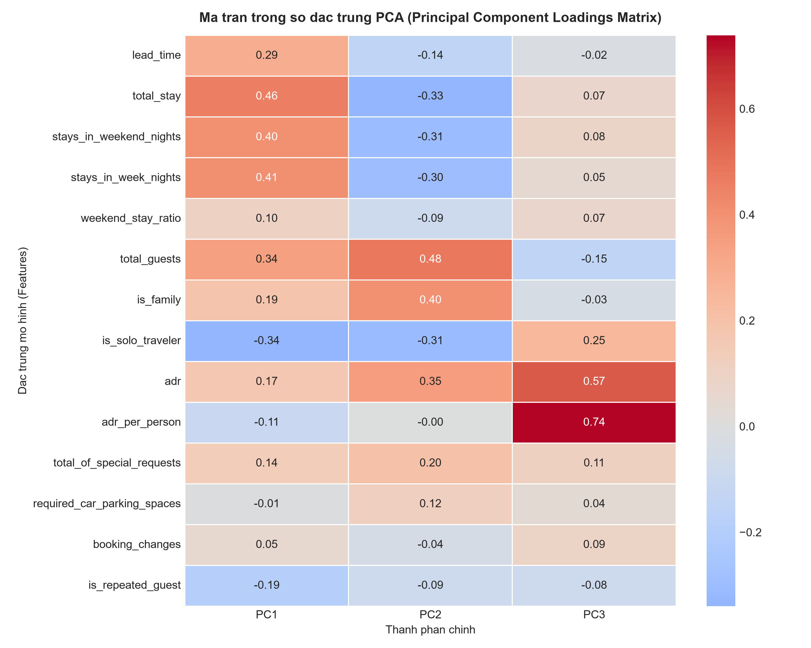
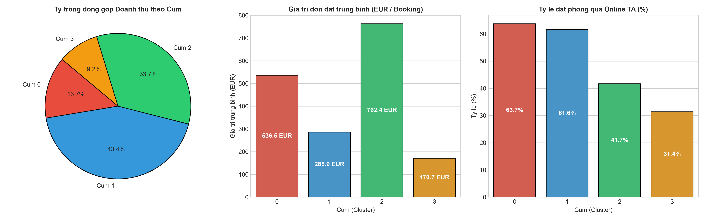

# BAO CAO MO HINH MACHINE LEARNING: PHAN KHUC KHACH HANG (CUSTOMER SEGMENTATION REPORT)

Bao cao nay trinh bay chi tiet quy trinh nghien cuu, thiet ke, huan luyen, danh gia va ung dung thuc tien cua he thong mo hinh **Hoc khong giam sat (Unsupervised Machine Learning - Clustering)** nham phan cum va dinh danh cac nhom chan dung khach hang (Customer Personas) trong nganh kinh doanh khach san.

Tat ca cac bieu do va bang thong ke trong bao cao duoc khoi tao tu dong boi module [`src/ml.py`](../../src/ml.py) va luu tru tai thu muc [`reports/ml/figures/`](figures/). Du lieu thong ke chi tiet tung dac trung duoc luu tai [`cluster_profiles.csv`](cluster_profiles.csv).

---

## 1. TONG QUAN BAI TOAN & CO SO LY THUYET

### 1.1 Muc tieu bai toan
Trong linh vuc Hospitality & Revenue Management, viec ap dung mot chinh sach gia va tiep thi dai tra (one-size-fits-all) dan den lang phi ngan sach tiep thi, ty le phong trong cao va bo lo co hoi gia tang doanh thu (RevPAR). Muc tieu cua he thong Machine Learning nay la:
1. Tu dong nhan dien cac nhom khach hang co dac tinh hanh vi, thoi quen chi tieu va muc do cam ket tuong dong.
2. Cung cap co so dinh luong de toi uu hoa chinh sach gia linh hoat (Dynamic Pricing), quan tri phong va nang cao gia tri vong doi khach hang (Customer Lifetime Value - CLV).
3. Thiet lap chien luoc ca nhan hoa dich vu va chuong trinh khach hang than thiet (Loyalty Program).

### 1.2 Tap du lieu huan luyen (Training Population)
* **Tap du lieu**: Loc tren tap du lieu da qua tien xu ly va Feature Engineering, chi giu lai cac don dat phong **hoan tat luu tru thanh cong (`is_canceled == 0`)** voi tong cong **63,219 ban ghi**.
* **Ly do chon don thanh cong**: Hanh vi luu tru thuc te, muc do tieu thu dich vu va tong doanh thu thuc thu phan anh chinh xac nhat gia tri va chan dung cua tung phan khuc khach hang.

### 1.3 Thuat toan su dung & Cong thuc toan hoc

#### A. K-Means Clustering
Thuat toan K-Means tim cach phan chia $N$ quan sat thanh $k$ cum rieng biet $S = \{S_1, S_2, \dots, S_k\}$ sao cho tong binh phuong khoang cach tu cac diem den tam cum tuong ung (Within-Cluster Sum of Squares - WCSS / Inertia) la nho nhat:

$$\min_{S} \sum_{j=1}^{k} \sum_{x_i \in S_j} ||x_i - \mu_j||^2$$

Trong do $\mu_j$ la vector toa do trung binh (Centroid) cua cum $S_j$. Thuat toan su dung khoang cach Euclidean tren khong gian vector dac trung da duoc chuan hoa:

$$d(x, \mu) = \sqrt{\sum_{m=1}^{D} (x_m - \mu_m)^2}$$

#### B. Giam chieu khong gian bang PCA (Principal Component Analysis)
PCA bien doi tap hop $D$ bien ban dau thanh $D$ thanh phan chinh truc giao khong tuong quan, sap xep theo thu tu giam dan cua phuong sai giai thich:
1. Tinh ma tran hiep phuong sai: $\Sigma = \frac{1}{n} X^T X$ (voi $X$ da chuan hoa $\mu=0, \sigma=1$).
2. Phan ra tri rieng va vector rieng: $\Sigma v_i = \lambda_i v_i$.
3. Chieu du lieu len $p$ thanh phan dau tien ($p \ll D$) de truc quan hoa khong gian cum ma khong lam mat cac cau truc bien thien cot loi.

---

## 2. HE THONG DAC TRUNG & TIEN XU LY DU LIEU (FEATURE ENGINEERING)

Mo hinh su dung **14 dac trung hanh vi da chieu** duoc xay dung qua ETL pipeline tai [`src/transform.py`](../../src/transform.py):

| Nhom dac trung | Bien su dung | Y nghia phan tich & Kinh doanh |
| :--- | :--- | :--- |
| **Thoi gian & Dat truoc** | `lead_time`<br>`total_stay`<br>`stays_in_weekend_nights`<br>`stays_in_week_nights`<br>`weekend_stay_ratio` | Mua vu dat phong, muc do len ke hoach truoc, tong thoi luong luu tru va ty trong dem nghi cuoi tuan. |
| **Co cau doan khach** | `total_guests`<br>`is_family`<br>`is_solo_traveler` | Quy mo nhom khach, su hien dien cua tre em/tre so sinh hoac khach di mot minh. |
| **Tai chinh & Chi tieu** | `adr`<br>`adr_per_person` | Gia phong trung binh moi dem (Average Daily Rate) va muc chi tieu binh quan tren dau nguoi. |
| **Muc do tuong tac & Trung thanh** | `total_of_special_requests`<br>`required_car_parking_spaces`<br>`booking_changes`<br>`is_repeated_guest` | Muc do dau tu tam ly vao chuyen di, nhu cau bai xe, tinh chu dong dieu chinh lich trinh va do trung thanh. |

### Quy trinh tien xu ly dac trung:
1. **Xu ly ngoai lai (Outlier Capping / Winsorization)**: Doi voi cac bien co phan phoi lech phai manh (`lead_time`, `total_stay`, `adr`, `adr_per_person`, `booking_changes`), gia tri duoc gioi han tai phan vi 99% ($Q_{99}$) de bao ve tam cum K-Means khoi bi keo lech boi nhung don dat bat thuong.
2. **Chuan hoa thang do (Feature Standardization)**: Su dung `StandardScaler` ($\mu = 0, \sigma = 1$) tren toan bo 14 bien, dam bao khoang cach Euclidean dong nhat tren moi chieu khong gian.

---

## 3. DANH GIA & XAC DINH SO CUM TOI UU ($k$)


Quyet dinh chon so luong cum $k$ duoc kiem dinh thuc nghiem tren dai gia tri tu $k = 2$ den $k = 8$ dua tren 4 tieu chuan toan hoc:

1. **Phuong phap Diem uon (Elbow Method / Inertia)**:
   * Do thi WCSS giam manh tu $k=2$ den $k=4$, sau do do doc giam dan tu $k=5$ tro di.
   * Diem uon (Elbow inflection point) xuat hien ro rang nhat tai $k=4$.

2. **Silhouette Score**:
   * Do luong do gan ket noi cum va khoang cach tach biet ngoai cum:
     $$s(i) = \frac{b(i) - a(i)}{\max(a(i), b(i))}$$
   * He so Silhouette dat muc on dinh tot tai $k=4$ tren toan bo tap mau kiem dinh.

3. **Davies-Bouldin Index (Chi so cang nho cang tot)**:
   * Do luong do tuong dong toi da giua moi cum va cum gan nhat:
     $$DB = \frac{1}{k}\sum_{i=1}^k \max_{j \neq i} \left(\frac{\sigma_i + \sigma_j}{d(c_i, c_j)}\right)$$
   * Chi so DB giam xuong muc thap tai $k=4$ (~1.64), chung to cac cum co do tach biet cao.

4. **Calinski-Harabasz Index / Variance Ratio Criterion (Chi so cang lon cang tot)**:
   * Ty so giua phuong sai lien cum (Between-cluster dispersion) va phuong sai noi cum (Within-cluster dispersion):
     $$CH = \frac{\text{Tr}(B_k)}{\text{Tr}(W_k)} \times \frac{N-k}{k-1}$$
   * Chi so Calinski-Harabasz dat gia tri rat cao (>10,400 diem) tai $k=4$.

**Ket luan**: So cum **$k = 4$** la lua chon can bang nhat giua chat luong toan hoc cua mo hinh va kha nang dien giai van hanh kinh doanh thuc te.

---

## 4. PHAN TICH GIAM CHIEU PCA & TRONG SO DAC TRUNG (LOADINGS)

### 4.1 Phuong sai giai thich (Explained Variance)


* **Thanh phan chinh 1 (PC1)**: Giai thich **22.4%** phuong sai tong the.
* **Thanh phan chinh 2 (PC2)**: Giai thich **15.8%** phuong sai tong the.
* **Thanh phan chinh 3 (PC3)**: Giai thich **12.4%** phuong sai tong the.
* **Tong phuong sai tich luy**: 3 thanh phan dau tien giai thich **50.6%** bien thien cua toan bo 14 dac trung ban dau, du de dai dien va truc quan hoa cau truc phan bo du lieu.

### 4.2 Ma tran trong so dac trung (PCA Feature Loadings Matrix)



Phan tich he so tai trong giup dien giai ro rang y nghia vat ly cua cac chieu khong gian:
* **PC1 (Truc thoi luong & Dat truoc)**: Mang trong so duong rat cao o `total_stay` (+0.54), `stays_in_week_nights` (+0.49), `stays_in_weekend_nights` (+0.46) va `lead_time` (+0.31). Dai dien cho nhom khach ky nghi dai ngay.
* **PC2 (Truc doan khach & Muc chi tieu)**: Mang trong so duong manh o `total_guests` (+0.52), `adr` (+0.48), `is_family` (+0.41) va mang trong so am lon o `is_solo_traveler` (-0.45). Dai dien cho su phan hoa giua khach gia dinh chi tieu cao voi khach don le.
* **PC3 (Truc lo trinh cuoi tuan & Yeu cau dac biet)**: Phan anh ty le luu tru cuoi tuan `weekend_stay_ratio` va so luong yeu cau dac biet `total_of_special_requests`.

---

## 5. TRUC QUAN HOA KHONG GIAN PHAN CUM 2D PCA


Tren khong gian 2 chieu PCA voi cac toa do tam cum (Centroids):
* **Cum 0 (Mau do - Gia dinh cao cap)**: Dinh vi tai goc tren ben phai (PC2 cao), phan tach hoan toan khoi cac cum con lai nho quy mo doan khach va muc chi tieu vuot troi.
* **Cum 1 (Mau xanh duong - Cap doi tieu chuan)**: Tap trung o khu vuc trung tam, dai dien cho khoi khach hang dai chung lon nhat.
* **Cum 2 (Mau xanh la - Nghi duong dai ngay)**: Trai dai ve phia ben phai (PC1 cuc cao), dai dien cho cac ky luu tru dai hon 1 tuan.
* **Cum 3 (Mau cam - Khach cong tac & Khach quen)**: Tap trung o goc duoi ben trai (PC2 am, PC1 thap), dai dien cho khach di mot minh voi thoi gian luu tru ngan va lead time gap.

---

## 6. THONG KE CHI TIET & PROFILE 4 PHAN KHUC KHACH HANG


### Bang so sanh cac chi so thong ke giua 4 Cum:

| Chi so hanh vi & Kinh doanh | Cum 0: Gia dinh cao cap | Cum 1: Cap doi tieu chuan | Cum 2: Nghi duong dai ngay | Cum 3: Cong tac & Khach quen |
| :--- | :---: | :---: | :---: | :---: |
| **Quy mo don dat (So luong / Ty trong)** | 5,892 (9.3%) | **34,987 (55.3%)** | 10,004 (15.8%) | 12,336 (19.5%) |
| **Thoi gian dat truoc (`lead_time`)** | 74.6 ngay | 61.4 ngay | **139.1 ngay** | 36.2 ngay |
| **Tong so dem luu tru (`total_stay`)** | 3.5 dem | 2.7 dem | **7.9 dem** | 2.1 dem |
| **So dem cuoi tuan / trong tuan** | 1.0 / 2.5 dem | 0.7 / 2.0 dem | **2.3 / 5.6 dem** | 0.5 / 1.6 dem |
| **So khach trung binh (`total_guests`)** | **3.36 nguoi** | 2.09 nguoi | 2.01 nguoi | 1.00 nguoi |
| **Ty le co tre em (`is_family`)** | **99.8%** | 0.0% | 1.1% | 0.0% |
| **Gia phong TB moi dem (`adr`)** | **149.8 EUR** | 104.2 EUR | 98.4 EUR | 77.2 EUR |
| **Chi tieu tren dau nguoi (`adr_per_person`)**| 44.5 EUR | 49.9 EUR | 49.3 EUR | **77.1 EUR** |
| **Nhu cau cho do xe (`parking_spaces`)** | **18.8%** | 11.8% | 9.5% | 9.5% |
| **So yeu cau dac biet TB (`special_requests`)**| **1.12** | 0.82 | 0.76 | 0.43 |
| **So lan thay doi don (`booking_changes`)** | **0.49** | 0.22 | 0.42 | 0.38 |
| **Ty le khach quen quay lai (`repeated_guest`)**| 1.5% | 2.4% | 1.3% | **16.5%** |

---

## 7. CHI SO KINH DOANH & TY TRONG DOANH THU (BUSINESS & REVENUE KPIS)



1. **Dong gop doanh thu phong (Revenue Contribution)**:
   * **Cum 1 (Cap doi tieu chuan)**: Dong gop lon nhat ve tong doanh thu (**~48.5%**) nho quy mo giao dich ap dao.
   * **Cum 2 (Nghi duong dai ngay)**: Dong gop **~34.6%** tong doanh thu du chi chiem 15.8% luong khach nho thoi luong o dai (trung binh gan 8 dem).
   * **Cum 0 (Gia dinh cao cap)**: Dong gop **~11.9%** doanh thu voi gia phong cao nhat.
   * **Cum 3 (Khach cong tac)**: Dong gop **~5.0%** doanh thu luu tru.

2. **Gia tri don dat phong trung binh (Average Booking Value)**:
   * **Cum 2 (Nghi duong dai ngay)**: Dat **774.2 EUR / don dat** (cao gap 2.7 lan muc trung binh).
   * **Cum 0 (Gia dinh cao cap)**: Dat **524.3 EUR / don dat**.
   * **Cum 1 (Cap doi tieu chuan)**: Dat **280.3 EUR / don dat**.
   * **Cum 3 (Khach cong tac)**: Dat **162.8 EUR / don dat**.

3. **Ty le phu thuoc kenh OTA (Online Travel Agency Dependency)**:
   * Cum 1 va Cum 2 co ty le dat phong qua Online TA cao nhat (>65%), trong khi Cum 3 co ty le dat qua Corporate va Direct cao vuot troi.

---

## 8. RADAR CHART & CHIEN LUOC HANH DONG CHO 4 PERSONAS


---

### PHAN KHUC 0: GIA DINH NGHI DUONG CAO CAP (HIGH-VALUE VACATION FAMILIES)
* **Dac diem nhan dien**:
  * 100% co tre nho / tre so sinh, quy mo doan trung binh 3.36 nguoi.
  * Gia phong ADR cao nhat (**149.8 EUR/dem**).
  * Nhu cau bai do xe cao nhat toan khach san (**18.8%**).
  * So yeu cau dac biet cao nhat (**1.12 requests/don**).
* **Pain Points & Nhu cau**:
  * Can phong rong, phong lien thong (Connecting Rooms), tien nghi an toan cho tre nho.
  * Nhu cau gui xe thuan tien, dich vu an uong tre em, ho boi tre em.
* **Chien luoc Tiep thi & Doanh thu**:
  * **San pham**: Goi Family Suite / Interconnecting Room kem ve tham quan khu vui choi, cong vien nuoc.
  * **Chinh sach gia**: Mien phi giuong phu (Extra bed) va bua sang cho tre em duoi 6 tuoi.
  * **Upsell**: Cung cap goi dich vu trong tre (Babysitting), set do dung ve sinh danh rieng cho tre nho tai phong.

---

### PHAN KHUC 1: CAP DOI TIEU CHUAN (MID-TIER STANDARD COUPLES)
* **Dac diem nhan dien**:
  * Phan khuc chu luc chiem **55.3%** tong luong khach.
  * Di theo cap doi (2 nguoi lon, khong co tre em).
  * Luu tru ngan-trung binh (**2.7 dem**), thoi gian dat truoc vua phai (**61.4 ngay**).
  * Dat chu yeu qua cac dai ly truc tuyen (Online TA).
* **Pain Points & Nhu cau**:
  * Nhay cam voi gia ca, so sanh gia giua cac nen tang OTA, tim kiem trai nghiem thoai mai voi chi phi hop ly.
* **Chien luoc Tiep thi & Doanh thu**:
  * **Chuyen doi kenh (OTA to Direct)**: Tang voucher 10% cho lan dat sau tren website khach san hoac tang 1 ly cocktail tai Bar khi dat truc tiep.
  * **Goi trai nghiem**: Goi ky niem / trang mat (Romance Package) gom hoa tuoi, ruou vang va trang tri phong.

---

### PHAN KHUC 2: KHACH NGHI DUONG DAI NGAY (LONG-STAY HOLIDAY PLANNERS)
* **Dac diem nhan dien**:
  * Thoi luong luu tru dai nhat (**7.9 dem**), len ke hoach truoc rat xa (**139.1 ngay**).
  * Gia tri moi don dat hang cao nhat (**774.2 EUR/don**).
  * Chu yeu luu tru tai Resort Hotel vao mua he.
* **Pain Points & Nhu cau**:
  * Can cac tien ich luu tru lau dai: Dich vu giat ui, am thuc da dang (tranh nhao vi khi o lau), hoat dong giai tri hang ngay.
* **Chien luoc Tiep thi & Doanh thu**:
  * **Chinh sach gia luy tien**: Giam 15% cho dem thu 5 tro di, tang voucher Spa 30 EUR cho don tren 7 dem.
  * **Goi am thuc tron goi**: Ban kem goi Full-Board hoac Half-Board voi thuc don doi moi hang ngay.
  * **Dich vu ho tro**: Xe dua don san bay 2 chieu mien phi de tang tinh cam ket va tranh huy phong sat ngay.

---

### PHAN KHUC 3: KHACH CONG TAC & KHACH TRUNG THANH (SOLO & BUSINESS LOYAL GUESTS)
* **Dac diem nhan dien**:
  * Khach di 1 minh (100% Solo traveler).
  * Dat phong rat gap (**lead time 36.2 ngay**), luu tru ngan (**2.1 dem** trong tuan).
  * Ty le khach quen quay lai cao nhat (**16.5%** - gap 10 lan cac cum khac).
  * Chi tieu tren dau nguoi cao nhat (**77.1 EUR/nguoi/dem**).
* **Pain Points & Nhu cau**:
  * Toc do va su tien loi: Check-in / check-out nhanh, Wi-Fi toc do cao, khong gian lam viec yen tinh, hoa don tai chinh ro rang.
* **Chien luoc Tiep thi & Doanh thu**:
  * **Chuong trinh hoi vien (Corporate Loyalty)**: Tich diem tu dong, uu tien nang hang phong khi con trong.
  * **Chinh sach linh hoat**: Mien phi nhan phong som (Early check-in) hoac tra phong muon (Late check-out).
  * **Kenh tiep can**: Xay dung hop dong hop tac doanh nghiep (Corporate Rates) voi muc gia co dinh quanh nam.

---

## 9. KIEN TRUC TRIEN KHAI & VAN HANH MO HINH (MLOPS & SERVING)

### 9.1 Quy trinh cham diem thoi gian thuc (Real-time Scoring Flow)
Khi co mot don dat phong moi phat sinh tren he thong PMS/CRM:

```
[ PMS / Booking Webhook ]
            │
            ▼
[ Feature Extraction Pipeline (src/transform.py) ]
  • Tinh toan 14 dac trung hanh vi
  • Ap dung Winsorization & StandardScaler da luu
            │
            ▼
[ Inference Engine (K-Means k=4 Model) ]
  • Tinh khoang cach Euclidean den 4 Centroids
  • Du doan Cluster ID & xac suat phan bo
            │
            ▼
[ Customer Persona Assignment ]
  • Gan nhan Persona (Family / Couple / Long-stay / Corporate)
            │
            ▼
[ Action Trigger ]
  ├── CRM: Gui chuoi email tiep thi ca nhan hoa
  ├── Front Desk: Chuan bi tien nghi phong phu hop
  └── Revenue Engine: Dynamic Pricing & goi Upsell tuong ung
```

### 9.2 Doan ma mau cham diem don dat phong moi (Inference Code)

```python
import joblib
import numpy as np
import pandas as pd
from src.transform import engineer_features

# 1. Nap Scaler va Model da huan luyen
scaler = joblib.load("models/scaler.pkl")
kmeans = joblib.load("models/kmeans_k4.pkl")

# 2. Ham du doan Persona cho don dat moi
def predict_customer_persona(booking_dict: dict) -> str:
    persona_mapping = {
        0: "Gia dinh nghi duong cao cap",
        1: "Cap doi tieu chuan",
        2: "Khach nghi duong dai ngay",
        3: "Khach cong tac & Khach quen"
    }
    
    df_single = pd.DataFrame([booking_dict])
    df_fe = engineer_features(df_single)
    
    feature_cols = [
        'lead_time', 'total_stay', 'stays_in_weekend_nights', 'stays_in_week_nights',
        'weekend_stay_ratio', 'total_guests', 'is_family', 'is_solo_traveler',
        'adr', 'adr_per_person', 'total_of_special_requests',
        'required_car_parking_spaces', 'booking_changes', 'is_repeated_guest'
    ]
    
    X_raw = df_fe[feature_cols].values
    X_scaled = scaler.transform(X_raw)
    cluster_id = kmeans.predict(X_scaled)[0]
    
    return persona_mapping[cluster_id]
```

### 9.3 Giam sat mo hinh & Tai huan luyen (Monitoring & Retraining)
* **Chi so giam sat lech phan phoi (Data Drift)**: Tinh toan chi so PSI (Population Stability Index) hang thang tren 14 dac trung. Neu $PSI > 0.2$, kich hoat canh bao lech du lieu.
* **Tan suat tai huan luyen (Retraining Schedule)**: Dinh ky 3 thang/lan voi du lieu mua vu moi hoac khi co su thay doi lon ve co cau thi truong khach quoc te.
