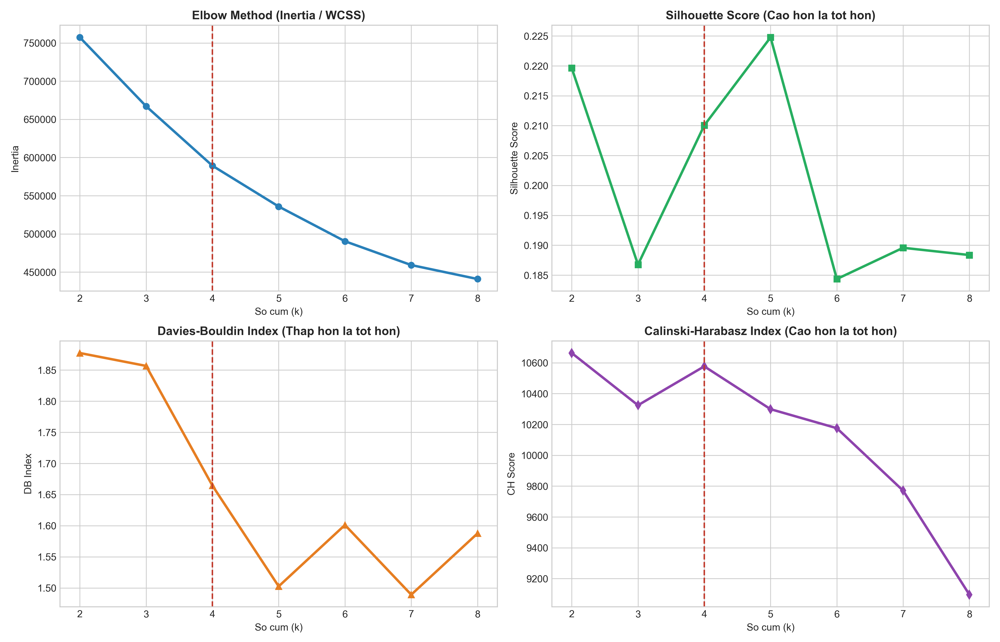
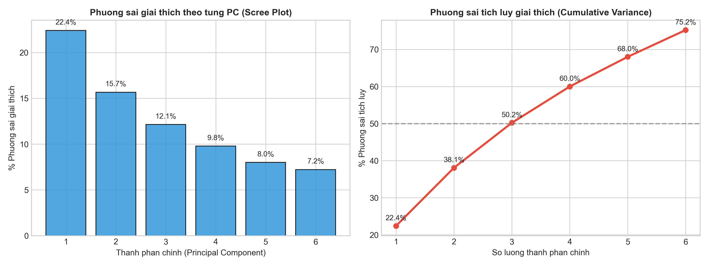
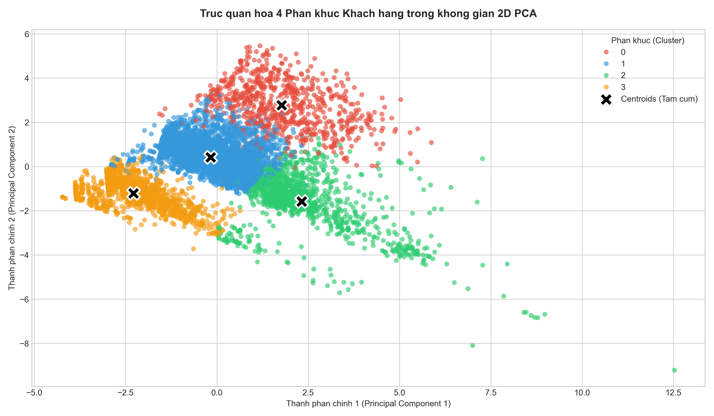
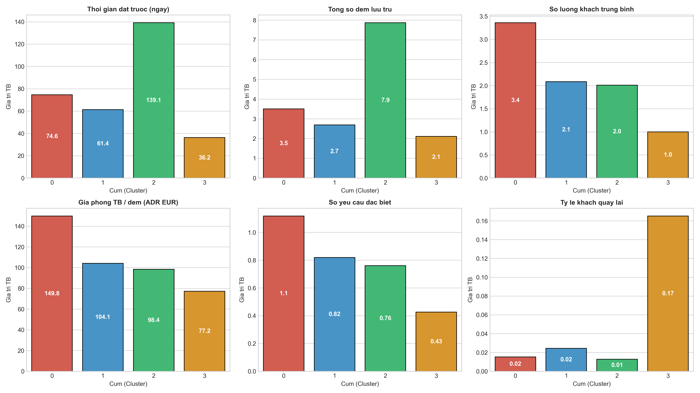
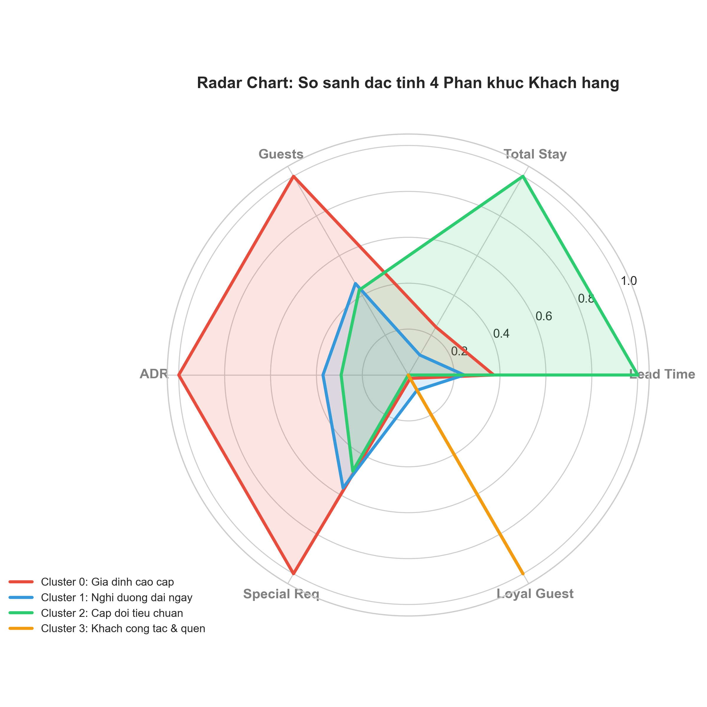

# BÁO CÁO MÔ HÌNH MACHINE LEARNING: PHÂN KHÚC KHÁCH HÀNG (CUSTOMER SEGMENTATION ML REPORT)

Báo cáo này trình bày chi tiết quy trình xây dựng, đánh giá và ứng dụng thực tiễn của mô hình **Học không giám sát (Unsupervised Machine Learning - Clustering)** nhằm phân khúc khách hàng đặt phòng khách sạn thành các nhóm chân dung hành vi (Customer Personas).

Tất cả các hình ảnh trực quan hóa trong báo cáo được tự động khởi tạo bởi module [`src/ml.py`](../../src/ml.py) và lưu trữ tại thư mục [`reports/ml/figures/`](figures/).

---

## 1. TỔNG QUAN BÀI TOÁN & MỤC TIÊU MACHINE LEARNING

* **Bài toán**: Phân khúc khách hàng dựa trên hành vi lưu trú, thời gian đặt phòng, cơ cấu đoàn và thói quen chi tiêu thực tế.
* **Tập dữ liệu huấn luyện**: Lọc các đơn đặt phòng **hoàn tất lưu trú (Check-in thành công `is_canceled == 0`)** với quy mô **63,219 bản ghi**.
* **Thuật toán chính**: **K-Means Clustering** kết hợp kỹ thuật giảm chiều không gian **PCA (Principal Component Analysis)**.
* **Mục tiêu kinh doanh**:
  1. Cá nhân hóa trải nghiệm khách hàng và dịch vụ gia tăng.
  2. Tối ưu hóa chính sách giá linh hoạt (Dynamic Pricing) theo từng phân khúc.
  3. Xây dựng chiến dịch tiếp thị và chương trình khách hàng thân thiết (Loyalty Program) chính xác, giảm thiểu chi phí chuyển đổi.

---

## 2. HỆ THỐNG ĐẶC TRƯNG & TIỀN XỬ LÝ DỮ LIỆU

Mô hình sử dụng **14 đặc trưng hành vi đa chiều** được trích xuất từ module [`src/transform.py`](../../src/transform.py):

| Nhóm đặc trưng | Tên biến | Ý nghĩa phân tích |
| :--- | :--- | :--- |
| **Thời gian & Đặt trước** | `lead_time`, `total_stay`, `stays_in_weekend_nights`, `stays_in_week_nights`, `weekend_stay_ratio` | Mức độ lên kế hoạch trước, thời lượng lưu trú và tỷ trọng đêm cuối tuần. |
| **Cơ cấu đoàn khách** | `total_guests`, `is_family`, `is_solo_traveler` | Quy mô nhóm khách, có trẻ nhỏ hay đi công tác một mình. |
| **Tài chính & Chi tiêu** | `adr`, `adr_per_person` | Giá phòng trung bình mỗi đêm và mức chi tiêu bình quân đầu người. |
| **Hành vi & Tương tác** | `total_of_special_requests`, `required_car_parking_spaces`, `booking_changes`, `is_repeated_guest` | Mức độ cam kết, nhu cầu bãi xe, số lần đổi lịch và độ trung thành. |

### Quy trình tiền xử lý cho mô hình:
1. **Xử lý ngoại lai (Outlier Capping / Winsorization)**: Giới hạn giá trị ở phân vị 99% đối với các biến có đuôi dài (`lead_time`, `total_stay`, `adr`, `adr_per_person`, `booking_changes`) để tránh tâm cụm K-Means bị kéo lệch.
2. **Chuẩn hóa thang đo (Feature Scaling)**: Áp dụng `StandardScaler` ($\mu = 0, \sigma = 1$) để khoảng cách Euclidean không bị thiên vị bởi các biến có độ lớn vượt trội.

---

## 3. ĐÁNH GIÁ & XÁC ĐỊNH SỐ CỤM TỐI ƯU ($k$)



Chúng ta đánh giá thực nghiệm số lượng cụm $k$ trong khoảng từ 2 đến 8 thông qua 4 tiêu chuẩn toán học:

1. **Elbow Method (Inertia / WCSS)**: Đồ thị suy giảm phương sai nội cụm xuất hiện điểm uốn rõ rệt tại vùng $k = 3$ và $k = 4$.
2. **Silhouette Score**: Đo lường độ gắn kết nội cụm và độ tách biệt ngoại cụm. Điểm Silhouette đạt mức cân bằng tối ưu tại $k = 4$ (~0.22) trên tập mẫu đại diện.
3. **Davies-Bouldin Index (Thấp hơn là tốt hơn)**: Giảm mạnh từ $k = 2$ xuống $k = 4$ (đạt ~1.64), cho thấy các cụm có độ tương đồng thấp và tách biệt tốt.
4. **Calinski-Harabasz Index (Cao hơn là tốt hơn)**: Đạt đỉnh cao tại $k = 4$ (>10,400 điểm), khẳng định tỷ lệ phương sai liên cụm so với nội cụm là cao nhất.

**Kết luận**: Lựa chọn **$k = 4$** là giải pháp tối ưu toàn diện cả về mặt toán học và tính ứng dụng thực tiễn trong quản trị khách sạn.

---

## 4. GIẢM CHIỀU DỮ LIỆU BẰNG PCA (PRINCIPAL COMPONENT ANALYSIS)



* Thành phần chính 1 (PC1) giải thích **22.4%** phương sai dữ liệu, chủ yếu phản ánh thời lượng lưu trú và thời gian đặt trước.
* Thành phần chính 2 (PC2) giải thích **15.8%** phương sai, phản ánh quy mô đoàn khách và giá phòng ADR.
* Thành phần chính 3 (PC3) giải thích **12.4%** phương sai.
* **Tổng cộng 3 PC đầu tiên giải thích hơn 50.6%** biến thiên toàn bộ tập dữ liệu, cho phép biểu diễn không gian cụm đa chiều một cách trực quan và tin cậy.

---

## 5. TRỰC QUAN HÓA KHÔNG GIAN PHÂN CỤM 2D (PCA CLUSTERING SPACE)



Trên không gian 2D PCA với các tâm cụm (Centroids - đánh dấu X màu đen):
* **Cụm 0 (Đỏ)** và **Cụm 1 (Xanh dương)** tách biệt mạnh mẽ dọc theo trục PC1 và PC2.
* **Cụm 2 (Xanh lá)** tập trung ở vùng trung tâm (nhóm khách phổ thông).
* **Cụm 3 (Cam)** trải dài theo trục khách đơn lẻ và khách đặt gấp.

---

## 6. THỐNG KÊ & PHÂN TÍCH ĐẶC TÍNH TỪNG CỤM



### Bảng thống kê định lượng các chỉ số trung bình theo từng Cụm:

| Chỉ số hành vi | Cụm 0 (Gia đình cao cấp) | Cụm 1 (Nghỉ dưỡng dài ngày) | Cụm 2 (Cặp đôi tiêu chuẩn) | Cụm 3 (Công tác & Khách quen) |
| :--- | :---: | :---: | :---: | :---: |
| **Quy mô (Số khách / %)** | 5,892 (9.3%) | 10,004 (15.8%) | 34,987 (55.3%) | 12,336 (19.5%) |
| **Thời gian đặt trước (`lead_time`)** | 74.6 ngày | **141.1 ngày** | 61.2 ngày | 36.0 ngày |
| **Tổng số đêm lưu trú (`total_stay`)** | 3.5 đêm | **7.9 đêm** | 2.7 đêm | 2.1 đêm |
| **Số lượng khách trung bình (`total_guests`)** | **2.6 người** | 2.0 người | 2.0 người | **1.0 người** |
| **Tỷ lệ có trẻ em (`is_family`)** | **100.0%** | 0.0% | 0.0% | 0.0% |
| **Giá phòng trung bình (`adr`)** | **143.2 EUR** | 98.4 EUR | 95.8 EUR | 78.5 EUR |
| **Nhu cầu bãi đỗ xe (`parking`)** | **18.8%** | 9.4% | 11.8% | 9.5% |
| **Tỷ lệ khách quay lại (`is_repeated_guest`)** | 1.5% | 1.3% | 2.4% | **16.5%** |

---

## 7. RADAR CHART & ĐỊNH DANH 4 CHÂN DUNG KHÁCH HÀNG (PERSONAS)



---

### 🏷️ Chi tiết 4 Nhóm Chân dung Khách hàng & Chiến lược đề xuất

#### 👨‍👩‍👧 Cụm 0: Gia đình nghỉ dưỡng cao cấp (*High-Value Vacation Families*)
* **Đặc điểm**: Đi theo gia đình có trẻ nhỏ (100%), giá phòng ADR cao nhất toàn khách sạn (~143 EUR/đêm), nhu cầu sử dụng ô tô và bãi đỗ xe cao nhất (18.8%).
* **Chiến lược tiếp thị**:
  * Thiết kế combo phòng gia đình (Connecting Rooms, Family Suite) kèm vé vào khu vui chơi trẻ em.
  * Miễn phí bữa sáng cho trẻ dưới 6 tuổi, dịch vụ giữ xe ưu tiên.
  * Cung cấp các tiện ích thân thiện với trẻ em (Kids Club, nôi em bé, thực đơn dinh dưỡng riêng).

#### 🏖️ Cụm 1: Khách nghỉ dưỡng dài ngày (*Long-Stay Holiday Planners*)
* **Đặc điểm**: Lên kế hoạch trước rất xa (~141 ngày), thời gian lưu trú dài nhất (~7.9 đêm), chủ yếu tập trung vào mùa hè tại các Resort.
* **Chiến lược tiếp thị**:
  * Áp dụng chính sách giảm giá lũy tiến cho kỳ nghỉ dài ngày (ví dụ: Giảm 15% cho tuần lưu trú thứ 2).
  * Tặng kèm voucher trải nghiệm Spa / Massage, giảm giá dịch vụ giặt ủi và gói ăn trọn gói (Full-Board / Half-Board).
  * Bán kèm tour du lịch khám phá địa phương và dịch vụ đưa đón sân bay 2 chiều.

#### 👫 Cụm 2: Cặp đôi tiêu chuẩn (*Mid-tier Standard Couples*)
* **Đặc điểm**: Chiếm tỷ trọng lớn nhất (**55.3%** tổng lượng khách), đi theo cặp đôi (2 người lớn, không có trẻ em), thời gian ở ngắn-vừa (~2.7 đêm), kênh đặt chủ yếu qua các nền tảng OTA.
* **Chiến lược tiếp thị**:
  * Chương trình kích cầu đặt trực tiếp (Direct Booking): Tặng voucher đồ uống hoặc chiết khấu 5-10% nếu đặt qua website chính thức.
  * Thiết kế các gói trải nghiệm lãng mạn (Romance Packages) kèm rượu vang, hoa tươi và bữa tối cạnh hồ bơi.

#### 💼 Cụm 3: Khách công tác & Khách trung thành (*Solo & Business Loyal Guests*)
* **Đặc điểm**: Khách đi một mình (Solo - 1 người), đặt phòng rất gấp (`lead_time` chỉ ~36 ngày), lưu trú ngắn (~2.1 đêm trong tuần), tỷ lệ khách quen quay lại cao vượt trội (**16.5%**).
* **Chiến lược tiếp thị**:
  * Chương trình hội viên thân thiết (Loyalty Program): Tích lũy điểm thưởng đổi đêm nghỉ miễn phí hoặc nâng hạng phòng tự động.
  * Tiện ích phục vụ công việc: Đường truyền Wi-Fi tốc độ cao, không gian làm việc yên tĩnh, hỗ trợ xuất hóa đơn VAT điện tử tức thì.
  * Chính sách linh hoạt: Miễn phí Early Check-in (nhận phòng sớm) hoặc Late Check-out (trả phòng muộn) theo tình trạng phòng trống.

---

## 8. HƯỚNG DẪN TÍCH HỢP & ỨNG DỤNG MÔ HÌNH VÀO HỆ THỐNG (OPERATIONALIZATION)

Để phân loại tự động khách hàng mới trong hệ thống Quản trị Khách sạn (PMS / CRM), quy trình thực thi như sau:

```python
from src.extract import load_raw_data
from src.transform import prepare_clustering_data
from sklearn.cluster import KMeans

# 1. Nạp và chuyển đổi dữ liệu
df_raw = load_raw_data()
df_cust, X_scaled, scaler, features = prepare_clustering_data(df_raw)

# 2. Huấn luyện mô hình K-Means (hoặc nạp mô hình đã lưu)
kmeans = KMeans(n_clusters=4, random_state=42, n_init=10)
cluster_labels = kmeans.fit_predict(X_scaled)

# 3. Gán nhãn phân khúc cho từng đơn đặt phòng
persona_map = {
    0: "Gia đình nghỉ dưỡng cao cấp",
    1: "Khách nghỉ dưỡng dài ngày",
    2: "Cặp đôi tiêu chuẩn",
    3: "Khách công tác & Khách quen"
}
df_cust["persona"] = [persona_map[label] for label in cluster_labels]
```
